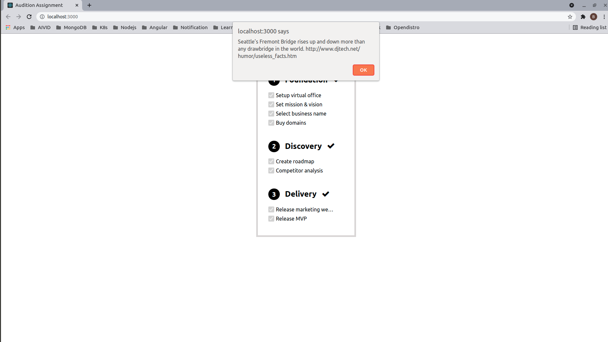
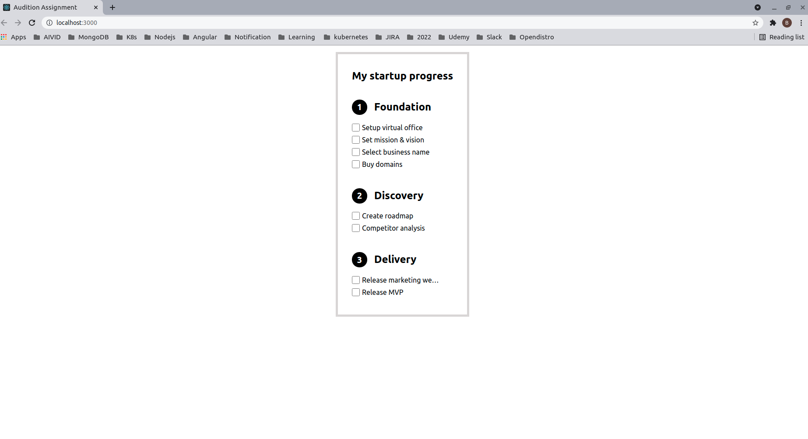
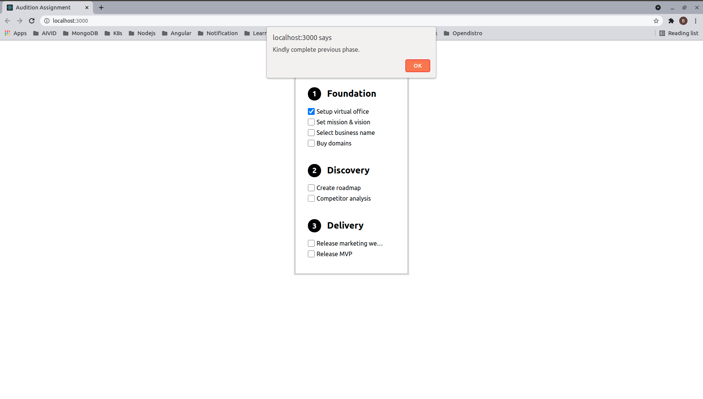

# Audition Assignment

This project was bootstrapped with [Create React App](https://github.com/facebook/create-react-app).

## Available Scripts

In the project directory, you can run:

### `yarn start`

Runs the app in the development mode.\
Open [http://localhost:3000](http://localhost:3000) to view it in the browser.

The page will reload if you make edits.\
You will also see any lint errors in the console.

### `TODO`

- Get data from API using useEffect.
- Replace alert with better UI popup.
- API call separation
- Pass data to backend for persistent storage.
- UI component for list element
- TDD - Test cases

### `screen shot`

  
   
  
   
  
   

